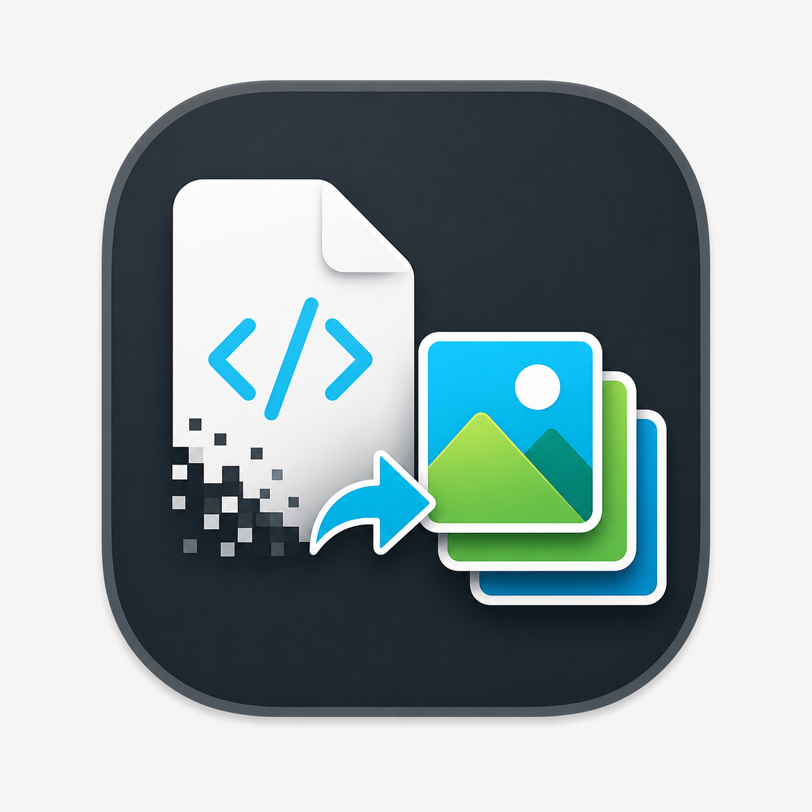

<p align="center">
  
</p>

# XML2Image

A desktop app for converting Android VectorDrawable XML files to PNG, JPG, or WebP.

Batch convert vector drawables, drag and drop files or folders, choose output size and format, and export images from a small cross-platform Swing UI.


## Features

- Batch Conversion - Add individual XML files or whole folders.
- Drag and Drop - Drop files or folders directly into the app.
- Multiple Formats - Export PNG, JPG, or WebP.
- Size Controls - Scale output or override width and height.
- Transparency Control - Keep alpha for PNG/WebP or export with a white background for JPG.
- Android Vector Support - Parses common VectorDrawable paths, fills, strokes, groups, transforms, and arcs.
- Cross-Platform Builds - macOS DMG, Linux tar.gz, and Windows zip with an `.exe` launcher.

## Installation

Download the latest package from GitHub Releases:

```text
https://github.com/dungngminh/xml2image/releases
```

Choose the package for your platform:

- macOS: `XML Resource Converter-lite-*.dmg`
- Linux: `xml2image-lite-*.tar.gz`
- Windows: `xml2image-windows-lite-*.zip`

Java 21 or newer must be installed on the target machine.

## Run From Source

```sh
git clone https://github.com/dungngminh/xml2image.git
cd xml2image
./run.sh
```

Or with Gradle:

```sh
gradle run
```

## Build

Build lightweight Linux and Windows archives:

```sh
gradle packageLite
```

Build the macOS lite DMG:

```sh
./package-dmg-lite.sh
```

Build the macOS DMG with a bundled stripped Java runtime:

```sh
./package-dmg.sh
```

Outputs are written to:

```text
build/distributions/
build/jpackage/output/
```

## Platform Notes

- macOS packages use `src/main/resources/macos/AppIcon.icns`.
- Linux archives include `share/icons/xml2image.png` and `xml2image.desktop`.
- Windows archives include a jpackage-generated `XML2Image.exe` launcher with `share/icons/xml2image.ico`.
- Lite packages do not bundle Java; install Java 21+ before running them.

## Notes

- Input must be Android `<vector>` drawable XML.
- PNG keeps transparency when `Keep alpha` is enabled.
- JPG is written on a white background.
- WebP uses Java ImageIO if available, otherwise it calls `cwebp` from `PATH`.

## Contributing

```sh
git clone https://github.com/dungngminh/xml2image.git
cd xml2image
gradle jar
```

Before opening a pull request, run the relevant build command for the package you changed.

## License

MIT - see [LICENSE](LICENSE).
